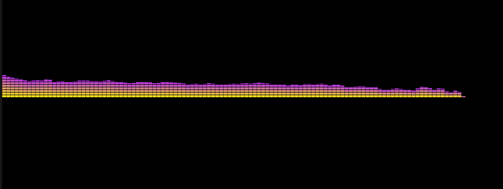

# MusicDance
让音乐的节奏律动表达出来

如图

工具是 CocosCreator 3.8.0

实现思路:
1. 获取音频播放器的音频采样数据,
2. 用采样数据和shader把每列的数据用色值进行过度一下

视频链接
【用cocoscreator3.8.0做了一个音乐律动】https://www.bilibili.com/video/BV1W1421z73m?vd_source=962e0ad7e4cbb325671505ba89505696

博客链接
https://blog.csdn.net/MuMuLiuNian/article/details/138702424

喜欢的话记得给个 star